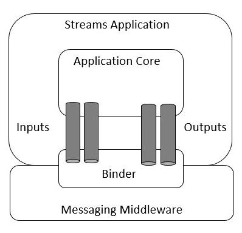

# Stream
- [Core-neutral message middleware](https://docs.steeltoe.io/api/v3/stream/stream-reference.html)
- No need to deal with the messaging middleware, focus on the messaging itself
- Channels as programming abstractions representing message destinations
- Steeltoe Stream automatically configures channels for you and connects them to external messaging systems through middleware-specific binder implementations

## Binders
- abstraction used by Steeltoe that enables Stream-based application services to integrate with external messaging systems
- includes the responsibility for connectivity, delegation, and routing of messages to and from producers and consumers
- support for data type conversions, invocation of the application code responsible for processing messages
- implement the boilerplate code

## Bindings
- bridge between the external messaging system and application-provided methods which act as producers and consumers
- `EnableBinding` attribute
- `ISource`(producer)
- `ISink` (consumer)
- `IProcessor` (both Sink & Source)